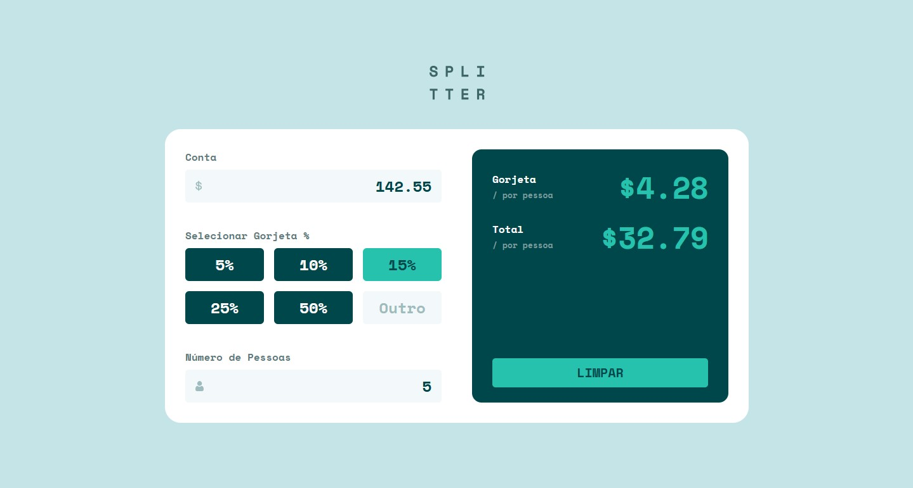

# Frontend Mentor - Tip calculator app solution

This is a solution to the [Tip calculator app challenge on Frontend Mentor](https://www.frontendmentor.io/challenges/tip-calculator-app-ugJNGbJUX). Frontend Mentor challenges help you improve your coding skills by building realistic projects.

## Table of contents

- [Overview](#overview)
  - [The challenge](#the-challenge)
  - [Screenshot](#screenshot)
  - [Links](#links)
- [My process](#my-process)
  - [Built with](#built-with)
  - [What I learned](#what-i-learned)
  - [Continued development](#continued-development)
  - [AI Collaboration](#ai-collaboration)
- [Author](#author)

## Overview

### The challenge

Users should be able to:

- View the optimal layout for the app depending on their device's screen size
- See hover and active states for all interactive elements on the page
- Calculate the correct tip and total cost of the bill per person in real-time
- See a validation error when the number of people is set to zero or left invalid

### Screenshot



### Links

- Solution URL: [GitHub repository](https://github.com/mnyellison/tip-calculator-app)
- Live Site URL: [Vercel Deploy](https://splitter-tip-calculator-five.vercel.app/)

---

## My process

### Built with

- Semantic HTML5 markup
- CSS Custom Properties (Variables)
- Flexbox and CSS Grid
- Vanilla JavaScript (ES6+)
- Mobile-first workflow

---

### What I learned

During this project, I significantly improved my DOM manipulation skills, architecture planning, and state management using vanilla JavaScript.

Key learnings include:

1. **UX Constraints**: Handling browser focus with `.blur()` to seamlessly remove element focus when triggering validation errors.
2. **Reactive Logic & Synchronization**: Implementing mutual cleanup loops between predefined percentage buttons and custom input fields so they don't overwrite each other.
3. **Array Batching**: Utilizing nested `forEach` loops to perform cleanups (removing classes from all elements) before applying active states (`.selected`) to the target clicked button.

Here are a few code snippets I'm proud of:

```css
/* Styling dynamic selected states and preventing default pointer behavior when disabled */
.tip-options-grid button.selected {
  background-color: var(--color-green-400);
  color: var(--color-green-900);
}

.btn-reset:disabled {
  background-color: var(--color-green-750);
  color: var(--color-green-800);
  cursor: not-allowed;
}
```

```js
// Cleaning up all selected buttons before highlighting the newly clicked one
buttons.forEach((button) => {
  button.addEventListener("click", () => {
    buttons.forEach((btn) => btn.classList.remove("selected"));
    button.classList.add("selected");

    tipPercentage = parseFloat(button.dataset.percentage);
    inputCustomTip.value = "";

    toggleResetButton();
    calculateTip();
  });
});
```

```js
// Defensive mathematical calculation to completely avoid rendering NaN errors on screen
function calculateTip() {
  if (isNaN(bill) || bill <= 0 || isNaN(people) || people <= 0) {
    tipAmountResult.innerText = "0.00";
    totalAmountResult.innerText = "0.00";
    return;
  }

  const totalTip = bill * (tipPercentage / 100);
  const tipPerPerson = totalTip / people;
  const totalPerPerson = bill / people + tipPerPerson;

  tipAmountResult.innerText = tipPerPerson.toFixed(2);
  totalAmountResult.innerText = totalPerPerson.toFixed(2);
}
```

---

### Continued development

For future projects, I want to keep focusing on:

- Centralizing application state management more effectively.
- Writing cleaner, production-grade conditional statements.
- Implementing robust English git workflows (Conventional Commits) split by logic (`feat:`) and styling (`style:`).

---

### AI Collaboration

I collaborated with Gemini as an adaptive AI pair programmer during this project.

- **How I used it**: We brainstormed architectural decisions, like whether validation should live within the input listeners or the centralized calculation wrapper. We also debugged edge cases such as text inputs returning `NaN` when cleared with backspace.
- **What worked well**: The AI acted as a great sounding board, allowing me to take mature architectural ownership of the JavaScript structure while explaining how the event loop and dataset lookups work under the hood.

---

## Author

- Frontend Mentor - [@mnyellison](https://www.frontendmentor.io/profile/mnyellison)
